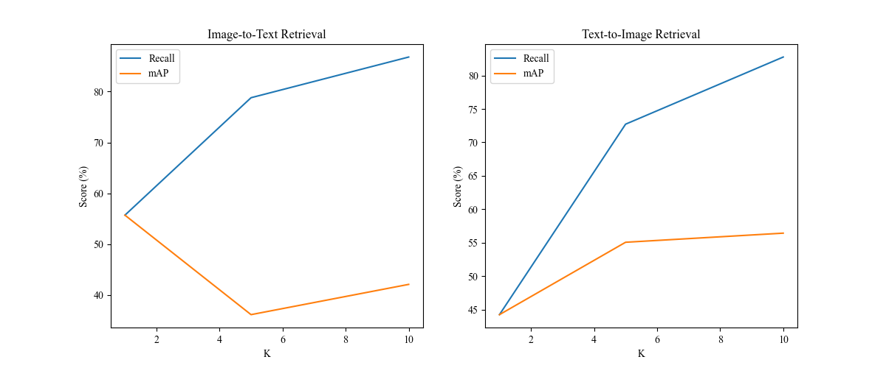

# CLIP-PyTorch 在flick8k数据集上微调

## 背景
CLIP属于是在跨模态训练无监督中的开山之作，收集了4亿数据的大数据集，才得到很好的效果。主要是采用对比方式，图像使用vit结构编码、文本使用bert编码，实现视觉与语言多模态融合。

这里的 [博客](https://blog.csdn.net/m0_62919535/article/details/147602965) 作为补充。
## 环境设置
我们建议你从上往下依次安装，最开始我的环境torch==2.2.0出现了警告：
[Flash 注意编译警告？](https://discuss.pytorch.org/t/flash-attention-compilation-warning/196692)
虽然无伤大雅，但我们还是建议采用下面的环境，需要注意到是pyzjr为本人自己写的库，一直在做更新，所以在这个项目当中推荐采用1.4.13版本

    pip install torch==1.8.0+cu111 torchvision==0.9.0+cu111 torchaudio==0.8.0 -f https://download.pytorch.org/whl/torch_stable.html  -i https://pypi.mirrors.ustc.edu.cn/simple/
    pip install scikit-learn -i https://pypi.tuna.tsinghua.edu.cn/simple
    pip install scikit-image -i https://pypi.tuna.tsinghua.edu.cn/simple
    pip install pywavelets -i https://pypi.tuna.tsinghua.edu.cn/simple
    pip install pyzjr==1.4.13 -i https://pypi.tuna.tsinghua.edu.cn/simple
    pip install ftfy -i https://pypi.tuna.tsinghua.edu.cn/simple
    pip install regex -i https://pypi.tuna.tsinghua.edu.cn/simple

## 文件下载
权重下载，进入 models/clip_utils.py 选择要下载的权重即可，默认会下载到 models/models_pth 路径下，安装完成后可以选择在主目录下的 
predict_zero_shot.py 文件进行zeroshot测试。测试结果大致如下所示：

    Label probs: [[9.547376e-01 4.508087e-02 8`.620646e-05 9.542132e-05]]
    two line charts: 0.9547376036643982
    image 0: [('two line charts', 0.9547376), ('a schematic diagra`m', 0.04508087), ('a landscape photo', 8.620646e-05), ('a oil painting', 9.542132e-05)]
flickr8k 数据集用的是 https://github.com/bubbliiiing/clip-pytorch 中的，只是我将原本的图片路径做了修改。
比如在en_train.json文件中：

    "image": "flickr8k-images\\2513260012_03d33305cf.jpg" ----> "image": "images\\2513260012_03d33305cf.jpg"
直接在pycharm中打开，Ctrl+R键将其全部替换就好了，需要注意的是这里没有对中文文本进行训练。

通过网盘分享的文件：flickr8k.zip，直接解压到工程项目中即可

链接: https://pan.baidu.com/s/1day8SS1im3faOrEPRIJyvw?pwd=k7j7 提取码: k7j7 

## 训练步骤
### a、flickr8k数据集
flickr8k数据集由数据图片路径与标注文本组成，其主要的结构如下所示：
```
    flickr8k
        - images
            - 667626_18933d713e.jpg
            - 3637013_c675de7705.jpg
            - 10815824_2997e03d76.jpg
            ......
        - cn_train.json
        - cn_val.json
        - en_train.json
            [
             {
                "image": "images\\2513260012_03d33305cf.jpg",
                "caption": [
                  "A black dog is running after a white dog in the snow .",
                  "Black dog chasing brown dog through snow",
                  "Two dogs chase each other across the snowy ground .",
                  "Two dogs play together in the snow .",
                  "Two dogs running through a low lying body of water ."
                ]
              },
              {
                "image": "images\\2903617548_d3e38d7f88.jpg",
                "caption": [
                  "A little baby plays croquet .",
                  "A little girl plays croquet next to a truck .",
                  "The child is playing croquette by the truck .",
                  "The kid is in front of a car with a put and a ball .",
                  "The little boy is playing with a croquet hammer and ball beside the car ."
                ]
              },
                ......
            ]
        - en_val.json
```
### b、网络训练 
修改 train.py 文件的parse_args的参数 

    resume_training： 下载的权重路径 ViT-B-16、ViT-B/32等等
    dataset_path：    flickr8k数据集路径，本文为 E:\PythonProject\clip_pytorch\flickr8k

其他的参数默认或者简单修改即可，此外我们这里不推荐使用amp。

### c、训练结果预测   
运行后输入图片路径，运行predict.py进行检测。

## 推理步骤
关于模型的推理，在 utils/metric.py 中进行了测试，你可以运行这个文件进行简单的测试，
我们提供了 Recall@K 和 mAP@K

* Recall@K 衡量前K个结果是否包含正确答案 
* mAP@K    衡量前K个结果的排序质量（考虑位置加权）


## Reference
https://github.com/openai/CLIP
https://github.com/mlfoundations/open_clip
https://github.com/bubbliiiing/clip-pytorch
